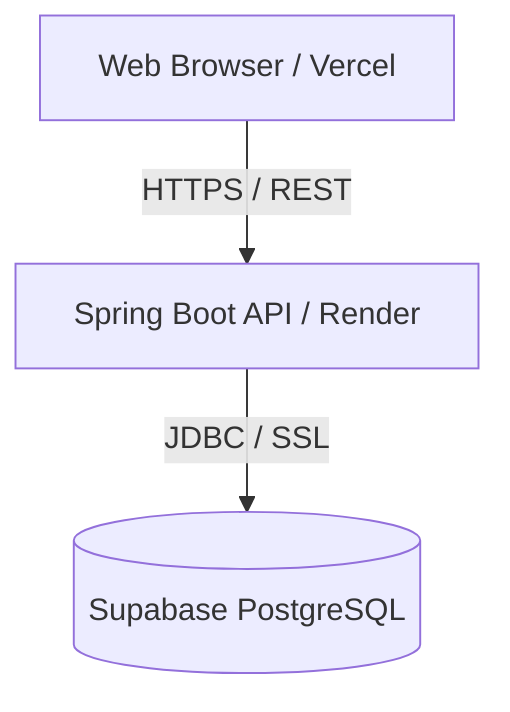
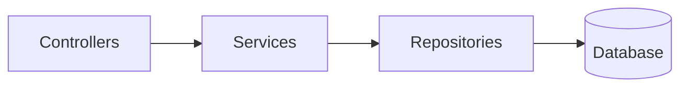

# Architecture Overview

InvenTrack is a modern, full-stack inventory management system designed with a clear separation of concerns. The architecture is split between a stateless frontend client and a RESTful backend API.

## High-Level Architecture

## Frontend Architecture

The frontend is a lightweight, dependency-free vanilla HTML/CSS/JS application.
- **UI Layer:** HTML5 and CSS3 (custom stylesheets).
- **Data Layer:** `api.js` acts as a central API client handling all REST calls, JWT injection, and error catching.
- **Routing:** Simple file-based routing (`login.html`, `dashboard.html`).
- **State Management:** Uses LocalStorage for JWT token persistence.
- **Deployment:** Vercel (serves static files and rewrites `/api/*` to the backend).

## Backend Architecture

The backend is built with Java Spring Boot, following a standard N-Tier (Clean Architecture) pattern.

1. **Controllers (`com.inventory.controller`)**: Handle incoming HTTP requests, input validation, and HTTP responses.
2. **Services (`com.inventory.service`)**: Contain core business logic, transaction management, and complex calculations (e.g., stock value).
3. **Repositories (`com.inventory.repository`)**: Spring Data JPA interfaces for database access.
4. **Security (`com.inventory.security`)**: Spring Security configuration, JWT filtering, and role-based access control.

## Database Schema

The database uses PostgreSQL (hosted on Supabase) with the following core entities:
- `users`: Authentication and roles (ADMIN, MANAGER, STAFF).
- `products`: Core inventory items.
- `categories`: Product categorization.
- `suppliers`: Supplier contact and mapping.
- `transactions`: Log of all stock movements (IN, OUT, ADJUSTMENT).

## Security

- **Authentication:** Stateless JSON Web Tokens (JWT).
- **Password Hashing:** BCrypt.
- **CORS:** Configured to only allow the production Vercel domain and localhost during development.
- **SQL Injection Prevention:** Handled automatically by Hibernate ORM.
